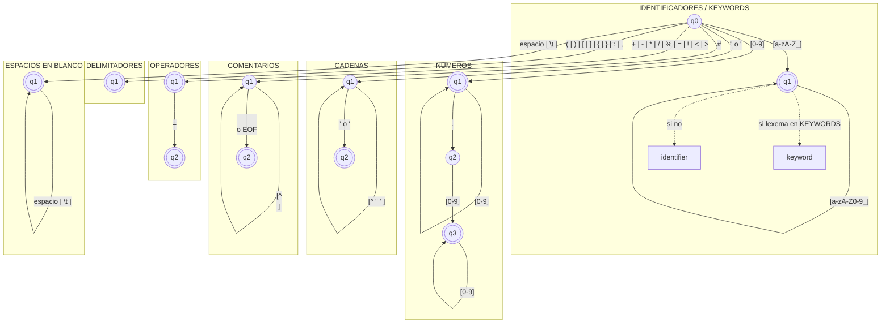

# DFA - Analizador Lexico para Python

```mermaid
flowchart TD

    q0(( q0 ))

    subgraph ID ["IDENTIFICADORES / KEYWORDS"]
        direction LR
        q0 -->|" [a-zA-Z_] "| q1_id(((q1)))
        q1_id -->|" [a-zA-Z0-9_] "| q1_id
        q1_id -.->|" si lexema en KEYWORDS "| kw["keyword"]
        q1_id -.->|" si no "| idn["identifier"]
    end

    subgraph NUM ["NUMEROS"]
        direction LR
        q0 -->|" [0-9] "| q1_num(((q1)))
        q1_num -->|" [0-9] "| q1_num
        q1_num -->|" . "| q2_num(( q2 ))
        q2_num -->|" [0-9] "| q3_num(((q3)))
        q3_num -->|" [0-9] "| q3_num
    end

    subgraph STR ["CADENAS"]
        direction LR
        q0 -->|" &quot; o ' "| q1_str(( q1 ))
        q1_str -->|" [^ &quot; ' ] "| q1_str
        q1_str -->|" &quot; o ' "| q2_str(((q2)))
    end

    subgraph COM ["COMENTARIOS"]
        direction LR
        q0 -->|" # "| q1_com(( q1 ))
        q1_com -->|" [^\n] "| q1_com
        q1_com -->|" \n o EOF "| q2_com(((q2)))
    end

    subgraph OP ["OPERADORES"]
        direction LR
        q0 -->|" + | - | * | / | % | = | ! | < | > "| q1_op(((q1)))
        q1_op -->|" = "| q2_op(((q2)))
    end

    subgraph DEL ["DELIMITADORES"]
        direction LR
        q0 -->|" ( | ) | [ | ] | { | } | : | , "| q1_del(((q1)))
    end

    subgraph WS ["ESPACIOS EN BLANCO"]
        direction LR
        q0 -->|" espacio | \t | \n "| q1_ws(((q1)))
        q1_ws -->|" espacio | \t | \n "| q1_ws
    end
```