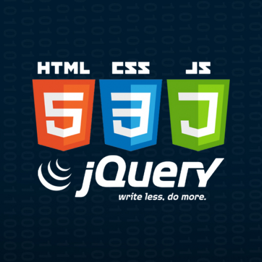

# CSTD

# Repositorio de la Materia: Construcción de Software y Toma de Decisiones

## Módulo: Desarrollo Web

Este repositorio contiene los códigos desarrollados durante las clases de la materia "Construcción de Software y Toma de Decisiones". En específico, se centra en el módulo de Desarrollo Web.

### Contenido

1. **HTML y CSS Básico**
   - Estructuración de páginas web.
   - Estilización con CSS.

2. **JavaScript Introductorio**
   - Fundamentos de JavaScript.
   - Manipulación del DOM.

3. **Frameworks y Librerías**
   - Uso de frameworks y librerías populares.
   - Ejemplos prácticos de implementación.

4. **Back-End Básico**
   - Conceptos básicos de servidores web.
   - Introducción a APIs y manejo de datos.

### Objetivo
El objetivo de este módulo es proporcionar una base sólida en el desarrollo web, cubriendo tanto aspectos front-end como conceptos básicos de back-end.

### Cómo Utilizar Este Repositorio

Cada carpeta dentro de este repositorio está organizada por actividad. 

### Contacto del profesor

